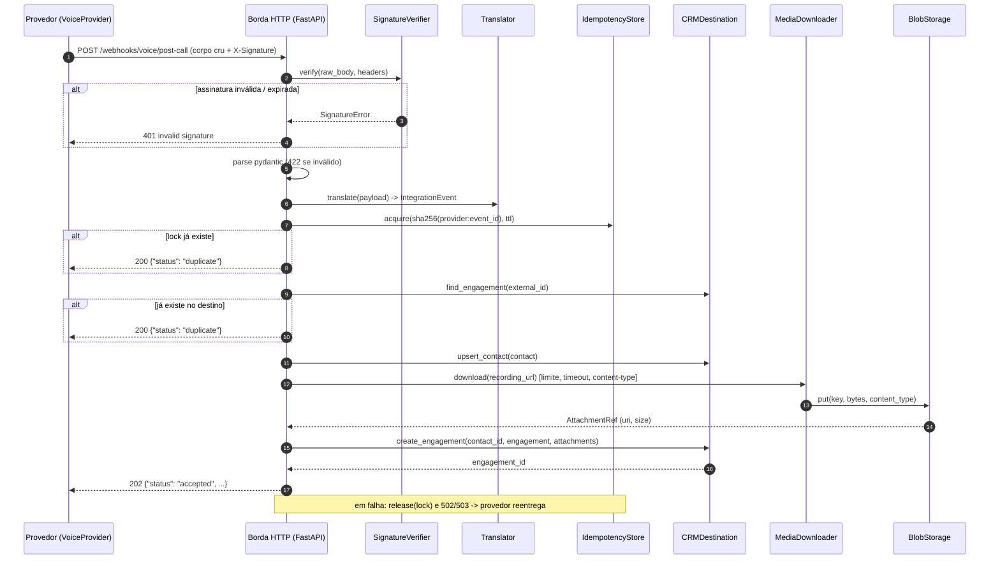

# webhook-relay

Serviço stateless que recebe webhooks de provedores externos, autentica na borda (HMAC com proteção contra replay), traduz o payload para o modelo do sistema de destino e aplica de forma **idempotente** em um CRM, copiando binários (áudio) para um object storage compatível com S3 antes que o link do provedor expire. Para times que precisam integrar plataformas de voz/chat a um CRM sem duplicar registros nem perder gravações.

[](.github/workflows/ci.yml)


[](LICENSE)


---

## Caso de uso real

Em **uma empresa do setor de energia**, o atendimento de primeiro nível passou a ser feito por uma plataforma de voz com IA (no estilo de uma plataforma como ElevenLabs). Ao final de cada ligação, a plataforma dispara um webhook com a transcrição, um resumo gerado e um link temporário para o áudio. O time de operações precisava que cada ligação virasse, automaticamente e em segundos, três coisas no CRM (um CRM como HubSpot): o contato atualizado, um registro de ligação com resumo e transcrição, e a gravação anexada.

Dois problemas apareceram logo nos primeiros dias. Primeiro, provedores de webhook **reentregam eventos**: por timeout, por retry agressivo, por reprocessamento em lote. Sem controle, cada reentrega virava mais um registro de ligação no CRM e poluía o histórico do cliente. Segundo, o **link do áudio expira** em poucos minutos; se o CRM demorasse para aceitar o anexo ou a primeira tentativa falhasse, a gravação simplesmente se perdia.

O padrão implementado aqui resolveu os dois pontos: autenticação forte na borda para que só o provedor consiga disparar o fluxo; uma chave de idempotência derivada do evento, verificada contra o próprio destino (que é a fonte da verdade) e protegida por um lock curto; e a cópia imediata do binário para storage próprio antes de criar o registro no CRM. O serviço ficou **sem banco de dados**, o que simplificou operação e escala horizontal, e passou a ser o **ponto único de entrada** para novos provedores: adicionar um canal de chat exigiu apenas um novo schema, um tradutor e um segredo.

> Este repositório é uma **reimplementação genérica**, com dados sintéticos e provedores fictícios (`VoiceProvider`, `ChatProvider`), do padrão aplicado em produção. Nenhum nome, URL, payload ou número real é usado.

## O que este projeto demonstra

- **Autenticação na borda com HMAC-SHA256** sobre o corpo cru + timestamp assinado (`X-Signature: t=<ts>,v1=<hex>`), tolerância de 5 minutos, `hmac.compare_digest`, suporte a rotação de segredo (múltiplos `v1`).
- **Idempotência em duas camadas**: chave `sha256(provider:event_id)`, lock curto `SET NX EX` (in-memory ou Redis) para concorrência, e consulta por `external_id` no destino como verificação autoritativa. Reentregas retornam `200 {"status": "duplicate"}` sem efeito colateral.
- **Ports & adapters com `typing.Protocol`**: `SignatureVerifier`, `CRMDestination`, `IdempotencyStore`, `BlobStorage`, `Translator`. Cada porta tem uma implementação real e um fake usado em demo e testes.
- **Resiliência no cliente HTTP**: retry com backoff exponencial e full jitter em 5xx/429 e erros de transporte; **sem retry em 4xx**; orçamento de tentativas configurável; `503 + Retry-After` para o provedor quando o destino está fora.
- **Download defensivo de mídia**: streaming com limite de bytes (aborta no meio), timeout, allow-list de `content-type`, apenas `http(s)`.
- **Ponto de commit explícito**: o registro com `external_id` é criado por último, de modo que uma falha no meio não deixa estado parcial e a reentrega completa o trabalho.
- **Observabilidade**: logs JSON com `request_id`, `provider`, `event_id`; propagação de `X-Request-ID`; mascaramento de telefone, documento e e-mail; `/healthz` e `/readyz` com checagem por dependência.
- **Testes 100% offline** em três níveis (unit, integration via `TestClient`, contract dos exemplos), HTTP externo mockado com `respx`, 99% de cobertura.
- **Empacotamento de produção**: `uv`, `ruff`, Dockerfile multi-stage sem `uv` na imagem final e usuário não-root, compose com Redis + MinIO (bucket inicializado), CI em GitHub Actions.

## Arquitetura



### Componentes

| Camada | Módulo | Responsabilidade |
|---|---|---|
| Borda HTTP | `api/webhooks.py`, `api/middleware.py`, `api/health.py` | Lê o corpo **cru** antes de qualquer parse, verifica assinatura, valida schema, mapeia erros de domínio para status HTTP, propaga `X-Request-ID`. |
| Segurança | `security/signature.py` | `SignatureVerifier` (Protocol) e `HmacSha256Verifier`. Função `build_signature_header` reutilizada pelo script de envio e pelos testes. |
| Schemas | `schemas/voice.py`, `schemas/chat.py`, `schemas/domain.py` | Payloads de cada provedor (com exemplos embutidos no OpenAPI) e o modelo interno `IntegrationEvent` (`ContactUpsert`, `EngagementRecord`, `MediaRef`, `AttachmentRef`). |
| Tradução | `translators/` | Funções puras: payload do provedor -> `IntegrationEvent`. Um tradutor por provedor. |
| Pipeline | `pipeline.py` | Orquestra `translate -> idempotency -> apply -> store`, controla o lock e o ponto de commit. |
| Idempotência | `idempotency/` | `idempotency_key`, `InMemoryIdempotencyStore` (TTL, clock injetável), `RedisIdempotencyStore` (`SET NX EX`). |
| Destino | `destination/` | `FakeCRMDestination` (dicts, thread-safe), `HttpCRMDestination` (httpx + `RetryPolicy`). |
| Storage | `storage/` | `LocalBlobStorage` (escrita atômica via `os.replace`), `S3BlobStorage` (boto3, `endpoint_url` para MinIO/LocalStack), `MediaDownloader`. |
| Composição | `container.py`, `config.py`, `main.py` | Settings via `pydantic-settings`; o container escolhe os adapters pelas env vars e os testes injetam fakes pelo mesmo construtor. |

### Fluxo de uma requisição

1. O middleware gera ou reutiliza `X-Request-ID` e o vincula ao contexto de log.
2. A rota lê `await request.body()` (bytes crus). Corpo acima de 1 MiB -> `413`.
3. `HmacSha256Verifier.verify` decodifica `t` e `v1`, rejeita timestamp fora da janela de 300 s e compara o HMAC de `f"{t}.{raw_body}"` em tempo constante. Falha -> `401`.
4. `PostCallPayload.model_validate_json(raw_body)`. Falha -> `422` com `loc`/`msg`/`type`, **sem ecoar valores** de entrada.
5. O pipeline roda em threadpool (`run_in_threadpool`) porque os adapters são síncronos.
6. `translate` produz o `IntegrationEvent` com `idempotency_key = sha256("voice-provider:evt_...")`.
7. `acquire(key)` no store; se o lock já existe, retorna `200 duplicate` consultando o destino para devolver o `engagement_id` existente.
8. `find_engagement(key)` no destino; se existe, `200 duplicate`.
9. `upsert_contact`, download e `put` de cada mídia (falhas de mídia são registradas em `media_errors` e não bloqueiam o evento, por padrão), `create_engagement` com os anexos.
10. `202 accepted` com ids e referências dos blobs. Qualquer exceção libera o lock e vira `502` (rejeição definitiva) ou `503 + Retry-After` (indisponibilidade).

### Decisões técnicas

| Decisão | Alternativa considerada | Por quê |
|---|---|---|
| Processamento **síncrono** na requisição | Enfileirar (SQS/RabbitMQ/Redis Streams) e responder 202 imediatamente | Latência total fica em centenas de ms e o provedor já faz retry; manter síncrono elimina um componente e dá ao provedor um status real (`duplicate`, `503`). A evolução natural é a rota só validar/assinar e publicar em fila; o `WebhookPipeline` já é desacoplado da rota para isso. |
| Destino como fonte da verdade da idempotência + lock curto | Tabela própria de eventos processados (Postgres) | Evita um banco só para deduplicação e sobrevive a perda do Redis: a consulta por `external_id` no destino continua barrando duplicatas. O lock só cobre concorrência e a janela quente. |
| Chave `sha256(provider:event_id)` | Usar `event_id` cru como `external_id` | Namespacing por provedor evita colisão entre provedores, o hash tem tamanho fixo e não expõe o id do provedor no CRM. |
| Engagement criado por último (commit point) | Criar registro e anexar mídia depois | Se o download falhar com o registro já criado, a reentrega seria vista como duplicata e o áudio se perderia para sempre. Criar por último mantém a reentrega útil. |
| Erros de mídia não bloqueiam por padrão (`fail_on_media_error=False`) | Falhar o evento inteiro | Um link de áudio expirado não deve impedir que a ligação apareça no CRM; a falha fica visível em `media_errors` e nos logs. O modo estrito existe para quem precisa da gravação como obrigatória. |
| Assinatura no estilo `t=...,v1=...` sobre o corpo cru | Assinar o JSON re-serializado | Qualquer re-serialização (ordem de chaves, espaços, unicode) quebraria a verificação; o timestamp dentro da mensagem assinada impede replay com timestamp novo. |
| `typing.Protocol` em vez de ABC | Classes base abstratas | Tipagem estrutural: fakes e stubs de teste não precisam herdar nada; o boto3/redis reais entram como `S3ClientLike`/`RedisLike` sem acoplamento. |
| Retry só em 5xx/429 e erros de transporte | Retry genérico | 4xx indica bug nosso (schema, auth); repetir só gera carga e mascara o problema. |
| Logging JSON com `logging` stdlib + formatter próprio | `structlog` | Zero dependência extra, integra com uvicorn e boto3, e o contexto por requisição vem de `contextvars`. |
| `uv` + `pyproject` com grupo `dev` | pip/poetry | Lockfile determinístico, instalação rápida em CI e no Dockerfile multi-stage. |

## Como executar

### Pré-requisitos

- Python 3.12+ e [`uv`](https://docs.astral.sh/uv/) (`uv python install 3.12` se necessário; o repositório fixa `3.12` em `.python-version`).
- Docker + Docker Compose apenas para o modo com Redis e MinIO.

### Instalação

```bash
git clone <este-repositorio> && cd webhook-relay
make install            # uv sync --all-groups
cp .env.example .env    # opcional: os defaults já rodam em modo demo
```

### Variáveis de ambiente (`.env.example`)

| Variável | Default (demo) | Descrição |
|---|---|---|
| `APP_ENV` | `demo` | `demo` habilita `/docs` e o endpoint `/demo/media/*`; `production` desliga ambos. |
| `VOICE_WEBHOOK_SECRET`, `CHAT_WEBHOOK_SECRET` | `demo-*-secret` | Segredo HMAC por provedor. |
| `SIGNATURE_TOLERANCE_SECONDS` | `300` | Janela aceita para o timestamp assinado. |
| `CRM_BACKEND` | `fake` | `fake` (em memória) ou `http` (`CRM_BASE_URL`, `CRM_API_TOKEN`, `CRM_MAX_RETRIES`). |
| `IDEMPOTENCY_BACKEND` | `memory` | `memory` ou `redis` (`REDIS_URL`); `IDEMPOTENCY_LOCK_TTL_SECONDS`. |
| `BLOB_BACKEND` | `local` | `local` (`LOCAL_BLOB_DIR`) ou `s3` (`S3_BUCKET`, `S3_ENDPOINT_URL`, `S3_REGION`, credenciais AWS padrão). |
| `MEDIA_MAX_BYTES`, `MEDIA_TIMEOUT_SECONDS`, `MEDIA_ALLOWED_CONTENT_TYPES` | 25 MiB, 20 s, áudio | Guard-rails do download de mídia. |

### Modo demo (sem credenciais, sem Docker)

```bash
make dev    # uvicorn em http://localhost:8000 com CRM fake, lock em memória e blobs em ./var/blobs
```

Em outro terminal, envie o payload de exemplo assinado. A flag `--local-media` aponta a URL da gravação para o endpoint `/demo/media/*.wav` do próprio serviço (um WAV sintético), para exercitar o download e o storage sem acesso à internet:

```bash
uv run python scripts/send_test_webhook.py --provider voice --local-media
```

Saída esperada (primeira entrega):

```text
POST http://localhost:8000/webhooks/voice/post-call
  X-Signature: t=1791123747,v1=b5aee75bf3cdf261fc3747f217c7e60d63d4ca50aafbf9de79a3d8c29bee0b59
HTTP 202
{
  "status": "accepted",
  "provider": "voice-provider",
  "event_id": "evt_voice_0001",
  "idempotency_key": "3587ba9c4e75554469229f021bd488cef753f72a9fdad8c0e6355e057d3be65a",
  "engagement_id": "engagement_2",
  "contact_id": "contact_1",
  "attachments": [
    {
      "key": "voice-provider/call_abc123/recording.wav",
      "uri": "file:///.../var/blobs/voice-provider/call_abc123/recording.wav",
      "content_type": "audio/wav",
      "size_bytes": 16044
    }
  ]
}
```

Reenvie o mesmo comando (reentrega do provedor):

```text
HTTP 200
{
  "status": "duplicate",
  "provider": "voice-provider",
  "event_id": "evt_voice_0001",
  "idempotency_key": "3587ba9c4e75...",
  "engagement_id": "engagement_2"
}
```

Outros cenários prontos no script:

```bash
uv run python scripts/send_test_webhook.py --provider voice --tamper      # corpo alterado após assinar -> 401
uv run python scripts/send_test_webhook.py --provider voice --skew -900   # timestamp 15 min atrás    -> 401
uv run python scripts/send_test_webhook.py --provider chat --local-media  # segundo provedor        -> 202
uv run python scripts/send_test_webhook.py --provider voice --random-event-id   # novo evento        -> 202
```

Sem `--local-media`, o payload mantém a URL fictícia do CDN do provedor; o evento é aceito (`202`) e a falha de download aparece em `media_errors`, exatamente como aconteceria em produção com um link expirado.

### Exemplo com `curl` (assinando manualmente)

```bash
BODY=$(cat examples/payload_post_call.json)
TS=$(date +%s)
SIG=$(printf '%s.%s' "$TS" "$BODY" | openssl dgst -sha256 -hmac "demo-voice-secret" | sed 's/^.* //')

curl -s -X POST http://localhost:8000/webhooks/voice/post-call \
  -H "Content-Type: application/json" \
  -H "X-Signature: t=$TS,v1=$SIG" \
  --data-binary "$BODY"
```

Saúde do serviço:

```bash
curl -s http://localhost:8000/healthz
# {"status":"ok","version":"0.1.0"}
curl -s http://localhost:8000/readyz
# {"status":"ready","checks":{"destination":true,"idempotency_store":true,"blob_storage":true}}
```

A documentação OpenAPI (com os payloads de exemplo) fica em `http://localhost:8000/docs` no modo demo.

### Com Docker (Redis + MinIO)

```bash
make up      # docker compose up --build -d: api, redis, minio e minio-init (cria o bucket)
make down    # derruba e remove volumes
```

O compose sobe a API com `IDEMPOTENCY_BACKEND=redis` e `BLOB_BACKEND=s3` apontando para o MinIO (`S3_ENDPOINT_URL=http://minio:9000`), mantendo `CRM_BACKEND=fake` por padrão. Para apontar a um CRM real, defina `CRM_BACKEND=http`, `CRM_BASE_URL` e `CRM_API_TOKEN` no `.env`. O console do MinIO fica em `http://localhost:9001` (`minioadmin`/`minioadmin`).

Logs de exemplo (uma linha JSON por evento, dados pessoais mascarados):

```json
{"ts": "2026-10-04T14:22:27.688+00:00", "level": "INFO", "logger": "webhook_relay.pipeline", "message": "media stored", "request_id": "307a0954...", "provider": "voice-provider", "event_id": "evt_voice_0001", "idempotency_key": "3587ba9c4e75", "blob_key": "voice-provider/call_abc123/recording.wav", "size_bytes": 16044, "content_type": "audio/wav"}
{"ts": "2026-10-04T14:22:27.688+00:00", "level": "INFO", "logger": "webhook_relay.pipeline", "message": "event applied", "request_id": "307a0954...", "provider": "voice-provider", "event_id": "evt_voice_0001", "idempotency_key": "3587ba9c4e75", "contact_id": "contact_1", "engagement_id": "engagement_2", "attachments": 1, "customer_phone": "***0000"}
```

## Testes

```bash
make test               # uv run pytest -q --cov=src --cov-report=term-missing
make lint               # ruff check + ruff format --check
```

Resultado atual (medido): **161 testes, 99% de cobertura** de `src/` (branch coverage habilitado), em cerca de 2 segundos, sem nenhuma chamada de rede.

| Nível | Onde | O que cobre |
|---|---|---|
| **Unit** | `tests/unit/` | Verificador HMAC (válido, segredo errado, corpo alterado, timestamp velho/futuro, replay com timestamp novo, header malformado, rotação de segredo); tradutores (mapeamento, determinismo, casos sem gravação/resumo); chave e stores de idempotência (TTL com clock fake, stub Redis com semântica `SET NX EX`); política de retry (classificação de status, backoff limitado, orçamento, erros de transporte); `HttpCRMDestination` com `respx`; storages local e S3 (stub de cliente boto3, sanitização de chave, escrita atômica); downloader (limite declarado e em streaming, content-type, timeout, esquema); pipeline (duplicata por lock, duplicata por destino com lock expirado, liberação do lock em falha, modo estrito de mídia); mascaramento e formatter JSON; settings; script de envio. |
| **Integration** | `tests/integration/` | Fluxo completo via `TestClient` com fakes: `202` e um registro no destino; reentrega -> `200 duplicate` e destino continua com **1** registro; assinatura errada/ausente/expirada -> `401`; corpo adulterado -> `401`; payload inválido -> `422` sem vazar valores; `413`; segredo de um provedor não vale para o outro; link de áudio expirado -> `202` com `media_errors`; destino fora -> `503 + Retry-After` e lock liberado; `/healthz`, `/readyz` degradado, wiring de produção sem conectar. |
| **Contract** | `tests/contract/` | `examples/*.json` validam contra os schemas e são idênticos aos exemplos embutidos no OpenAPI; campos desconhecidos são ignorados; valores inválidos são rejeitados; os exemplos contêm apenas dados sintéticos. |

Estratégia de fakes: cada porta (`CRMDestination`, `IdempotencyStore`, `BlobStorage`) tem uma implementação em memória usada tanto em demo quanto nos testes, injetada pelo mesmo `build_container(...)` da produção. HTTP de saída (CDN do provedor, CRM) é interceptado por `respx` com `assert_all_mocked=True`, então qualquer URL não prevista falha o teste em vez de tentar a rede. boto3 e redis reais nunca são chamados: os adapters recebem clientes que satisfazem `S3ClientLike`/`RedisLike`.

## Segurança

**Autenticação na borda.** Todo webhook precisa de `X-Signature: t=<ts>,v1=<hex>` com HMAC-SHA256 do corpo cru prefixado pelo timestamp, usando um segredo por provedor. Timestamps fora de ±300 s são rejeitados (replay), a comparação é em tempo constante e múltiplos `v1` permitem rotação de segredo sem janela de indisponibilidade. A verificação acontece **antes** de qualquer parse de JSON.

**Validação de entrada.** Schemas pydantic estritos nos tipos, com limites de tamanho em strings e listas, `Literal` para enums e `HttpUrl` para links; campos desconhecidos são ignorados para tolerar evolução do provedor. Corpo limitado a 1 MiB. Respostas `422` expõem apenas `loc`/`msg`/`type`, nunca o valor recebido.

**Mídia de terceiros tratada como não confiável.** Download em streaming com limite de bytes (aborta no meio do corpo, não só pelo `Content-Length`), timeout, allow-list de `content-type`, apenas `http(s)`. As chaves de blob são sanitizadas (`..`, barras) e o storage local garante que o caminho final está sob o diretório raiz.

**Gestão de segredos.** Tudo vem de variáveis de ambiente via `pydantic-settings`; segredos são `SecretStr` (não aparecem em `repr`/logs). `.env` está no `.gitignore`; `.env.example` só tem placeholders. A imagem Docker roda como usuário não-root e sem `uv`.

**Privacidade nos logs.** Telefones, documentos e e-mails são mascarados tanto nos campos estruturados quanto por regex na mensagem; o corpo do webhook nunca é logado.

**Superfícies consideradas.** Forja/replay de webhook; corpo adulterado após assinatura; payloads gigantes; URL de mídia apontando para esquema local (`file://`) ou servidor lento/infinito; path traversal em chaves de blob; duplicação por reentrega concorrente (lock atômico); destino fora do ar (retry com jitter, sem tempestade de retries em 4xx).

**O que NÃO está coberto (honestidade).**
- Não há proteção contra **SSRF** por IP: uma URL de mídia `http://169.254.169.254/...` seria baixada se o `content-type` passasse pela allow-list. Em produção, resolver DNS e bloquear faixas privadas/metadata, ou restringir hosts por provedor.
- Não há **rate limiting** nem WAF na aplicação; assume-se um gateway/ingress na frente.
- O **TLS** é responsabilidade do ingress/load balancer; o serviço fala HTTP puro.
- O lock de idempotência protege a janela do TTL; após expirar, a proteção depende da consulta ao destino, que é eventual se o CRM indexar `external_id` com atraso.
- Não há auditoria persistente dos eventos recebidos (o serviço é stateless por desenho); logs JSON são o único rastro.
- Dependências não são escaneadas por vulnerabilidades no CI (adicionar `pip-audit`/Dependabot seria o próximo passo).

## Estrutura do projeto

```text
webhook-relay/
├── src/webhook_relay/
│   ├── main.py                 # create_app(): lifespan, middleware, routers
│   ├── config.py               # Settings (pydantic-settings), defaults de demo
│   ├── container.py            # composition root: escolhe adapters pelas env vars
│   ├── pipeline.py             # translate -> idempotency -> apply -> store (commit point)
│   ├── logging.py              # JsonFormatter, contexto por request, mascaramento de PII
│   ├── errors.py               # exceções de domínio mapeadas para HTTP na borda
│   ├── api/
│   │   ├── webhooks.py         # POST /webhooks/voice/post-call, /webhooks/chat/message
│   │   ├── health.py           # GET /healthz, /readyz
│   │   ├── middleware.py       # X-Request-ID + access log
│   │   └── demo.py             # GET /demo/media/*.wav (apenas APP_ENV=demo)
│   ├── security/signature.py   # SignatureVerifier, HmacSha256Verifier, build_signature_header
│   ├── schemas/
│   │   ├── voice.py            # PostCallPayload (+ exemplo OpenAPI)
│   │   ├── chat.py             # ChatMessagePayload (+ exemplo OpenAPI)
│   │   └── domain.py           # IntegrationEvent, ContactUpsert, EngagementRecord, MediaRef...
│   ├── translators/            # Translator protocol, PostCallTranslator, ChatMessageTranslator
│   ├── idempotency/            # idempotency_key, InMemory/Redis IdempotencyStore
│   ├── destination/            # CRMDestination, FakeCRMDestination, HttpCRMDestination, RetryPolicy
│   └── storage/                # BlobStorage, LocalBlobStorage, S3BlobStorage, MediaDownloader
├── tests/
│   ├── conftest.py             # fixtures: settings, fakes, respx router, TestClient
│   ├── unit/                   # 11 módulos
│   ├── integration/            # fluxo HTTP completo + health
│   └── contract/               # examples/*.json x schemas
├── examples/                   # payload_post_call.json, payload_chat_message.json (sintéticos)
├── scripts/send_test_webhook.py# assina e envia um payload (--tamper, --skew, --local-media...)
├── .github/workflows/ci.yml    # ruff + pytest (3.12, 3.13) + docker build
├── Dockerfile                  # multi-stage, imagem final sem uv, usuário não-root
├── docker-compose.yaml         # api + redis + minio + minio-init (bucket)
├── Makefile                    # install, dev, test, lint, format, up, down
├── pyproject.toml              # deps, grupo dev, ruff, pytest, coverage
├── .env.example
└── LICENSE                     # MIT
```

## Roadmap / limitações conhecidas

- **Fila assíncrona**: separar recepção (verificar, validar, publicar) de processamento (worker consumindo a fila) para absorver picos e isolar a latência do CRM. O `WebhookPipeline` já é independente da rota, então a mudança fica confinada à borda e a um novo entrypoint de worker.
- **Proteção SSRF** no `MediaDownloader` (bloqueio de IPs privados/metadata e allow-list de hosts por provedor).
- **Dead-letter**: hoje, após `503`, o serviço depende do retry do provedor; uma DLQ própria daria visibilidade e reprocessamento controlado.
- **Métricas**: expor contadores (aceitos, duplicados, 401, falhas de mídia) e histogramas de latência em Prometheus/OpenTelemetry.
- **Mais provedores**: cada novo provedor é um schema + tradutor + segredo; um registro declarativo (`providers.py`) evitaria repetir a rota.
- **Verificadores alternativos**: assinatura assimétrica (Ed25519) ou JWT para provedores que não usam HMAC — a porta `SignatureVerifier` já prevê isso.
- **Testes de carga e de concorrência real** (dois workers recebendo a mesma reentrega simultaneamente contra Redis) não fazem parte da suíte atual, que valida a semântica do lock com stubs.
- O `FakeCRMDestination` faz upsert por telefone-ou-e-mail; um CRM real pode exigir regras de merge mais ricas.

## Licença

[MIT](LICENSE) — Copyright (c) 2026 Romeu Oliveira.
